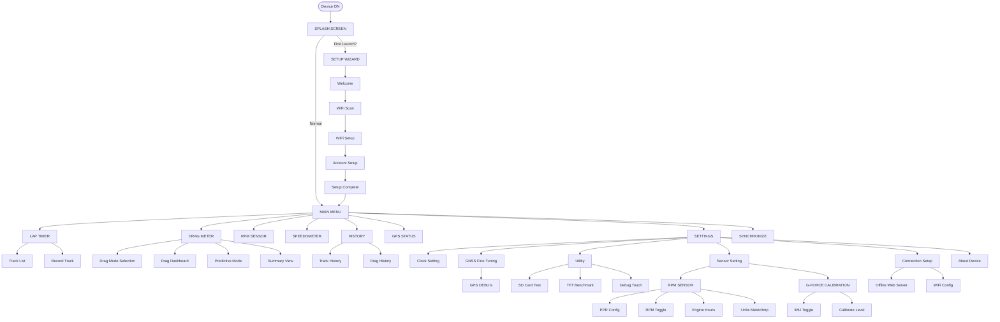

# Much Racing - Menu Structure & Navigation

This document outlines the menu system and configuration options for the Much Racing firmware.

## 1. Startup & Setup Flow (Booting)

The process starts when the device is powered on.

- **SPLASH SCREEN**: Displays the "ENGINE STARTING" logo and progress bar.
  - Checks device configuration state.
  - **IF FIRST RUN**: Redirects to **SETUP WIZARD**.
  - **IF CONFIGURED**: Proceeds to **MAIN MENU**.

### Setup Wizard (First Launch Only)

- **WELCOME**: Initial greeting screen.
- **WIFI SCAN**: Scan and select a wireless network.
  - **Scan**: Refresh network list.
  - **Manual Setup**: Manually enter hidden/unlisted SSIDs.
  - **Skip**: Skip network configuration.
- **WIFI SETUP**: SSID selection and password entry.
- **ACCOUNT SETUP**: Cloud synchronization setup.
  - **Username & Password**: Login/Register.
  - **Sync**: Initial data synchronization.
  - **Skip**: Skip account linking.
- **SETUP COMPLETE**: Final confirmation before entering the main dashboard.

---

## 2. Main Menu (Core Dashboard)

The primary navigation hub after boot.

- **LAP TIMER**
  - GPS Signal Status ("Searching...")
  - **TRACK LIST**:
    - Select Track -> View Track Details.
    - Create New Track (Wizard).
  - **RECORD TRACK**: Manual track creation wizard.
- **DRAG METER**: High-performance drag racing analysis.
- **RPM SENSOR**: Real-time RPM virtualization.
- **SPEEDOMETER**: Digital "Pro" dashboard.
- **HISTORY**: Offline session database.
  - **TRACK HISTORY**: Managed by Month/Session.
    - Options: View Summary, Lap Lists, Delete.
  - **DRAG HISTORY**: Managed by Month/Session.
    - Options: View Results, Delete.
- **GPS STATUS**: Radar view of satellites and precision metrics (HDOP/Lat/Lon).
- **SETTINGS**: System-wide configuration.
- **SYNCHRONIZE**: Push/Pull data to Much Racing Cloud.

---

## 3. Settings Menu (Detailed Configuration)

- **CLOCK SETTING**: UTC Offset and manual time adjustment.
- **POWER SAVE**: Auto-off timer (1m, 5m, 10m, 30m, Never).
- **BRIGHTNESS**: PWM backlight control (10% - 100%).
- **GNSS FINE TUNING**:
  - **GNSS MODE**: Multi-constellation selection (GPS, GLO, GAL, BEI).
  - **COORD PROJECTION**: Toggle coordinate projection.
  - **FREQUENCY LIMIT**: Update rate (1Hz - 25Hz).
  - **DYNAMIC MODEL**: Portable, Automotive, Sea, Airborne models.
  - **SBAS SYSTEM**: Regional correction (EGNOS, WAAS, etc.).
  - **HARDWARE PINS**: Configurable RX/TX pin mapping.
  - **BAUD RATE**: Communication speed.
  - **RESET GPS**: Trigger Cold Start.
  - **GPS DEBUG**: Raw NMEA/UBX stream viewer.
- **UTILITY**: Peripherals diagnostics.
  - **SD CARD TEST**: Benchmark read/write performance.
  - **TFT BENCHMARK**: Graphics rendering performance test.
  - **DEBUG TOUCH**: Visual touch coordinate debugging.
- **SENSOR SETTING**:
  - **RPM SENSOR**: 
    - **PPR (Pulse Per Rev)**: Engine ignition configuration.
    - **RPM SENSOR**: Toggle hardware RPM detection.
    - **ENGINE HOURS**: Totalized cumulative run time.
    - **UNITS**: Toggle Metric (km/h) / Imperial (mph).
  - **G-FORCE CALIBRATION**:
    - IMU Toggle.
    - Level Calibration.
    - Manual Roll/Pitch Offsets.
- **CONNECTION SETUP**:
  - **OFFLINE SERVER**: Start local Web Server (Dashboard Access).
  - **WIFI CONFIG**: Scan and connect to networks.
  - **REMOVE ACCOUNT**: Full factory reset and data wipe.
- **ABOUT DEVICE**: Versioning, Device ID, and MAC address.

---

## 4. Navigation Map

